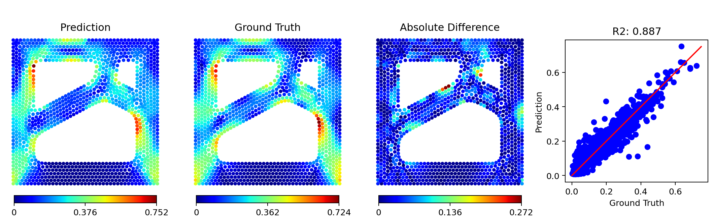

# Scalar Field Prediction on Topologically-Varying Graphs using Spectral Shape Encoding

#### Authors
_Kevin Ferguson_ and Levent Burak Kara, Carnegie Mellon University  

Andrew Gillman and James Hardin, Air Force Research Lab

### Abstract
Scalar fields, such as stress or temperature fields, are often calculated in shape optimization and design problems in engineering. For complex problems where shapes have varying topology and cannot be parametrized, data-driven scalar field prediction can be faster than traditional finite-element methods. However, current data-driven techniques to predict scalar fields are limited to a fixed grid domain, instead of arbitrary graph/mesh structures. In this work, we propose a method to predict scalar fields on meshes of arbitrary refinement and topology. It uses features that capture shape geometry on a local and global scale as input to a multilayer perceptron to predict solutions to partial differential equations on graph data structures. The proposed set of global features is a vector that concisely represents the entire mesh as a spectral shape encoding. The model is trained on finite-element von Mises stress fields, and once trained it can estimate stress values at each node on any input mesh. Two shape datasets are investigated, and the model demonstrates decent performance on both, with a median R-squared value of 0.75. We also demonstrate the model's performance on a temperature field in a conduction problem, where its predictions have a median R-squared value of 0.98. By predicting from a simple, yet rich, set of mesh features, our method provides a potential flexible alternative to finite-element simulation in engineering design contexts.

### Usage

#### Dataset generation
Dataset generation is done in MATLAB using the PDE Toolbox. See [dataset_generation/dataset_generation_info.txt](dataset_generation/dataset_generation_info.txt) for details on generating data. 

The datasets also can be downloaded from this [Google Drive link](https://drive.google.com/file/d/1mbKgWmByB4Pt6X2SUlHAnIpUouMwO_ld/view?usp=sharing).

#### Model training
The model is implemented in Pytorch. [This notebook](model_training/train_models.ipynb) steps through the process of loading datasets, creating models, and evaluating model performance. Model results can be visualized with the `plot_compare()` function in [model_training/evaluate.py](model_training/evaluate.py):

### Acknowledgment
This research was funded by Air Force Research Laboratory S111068002.
